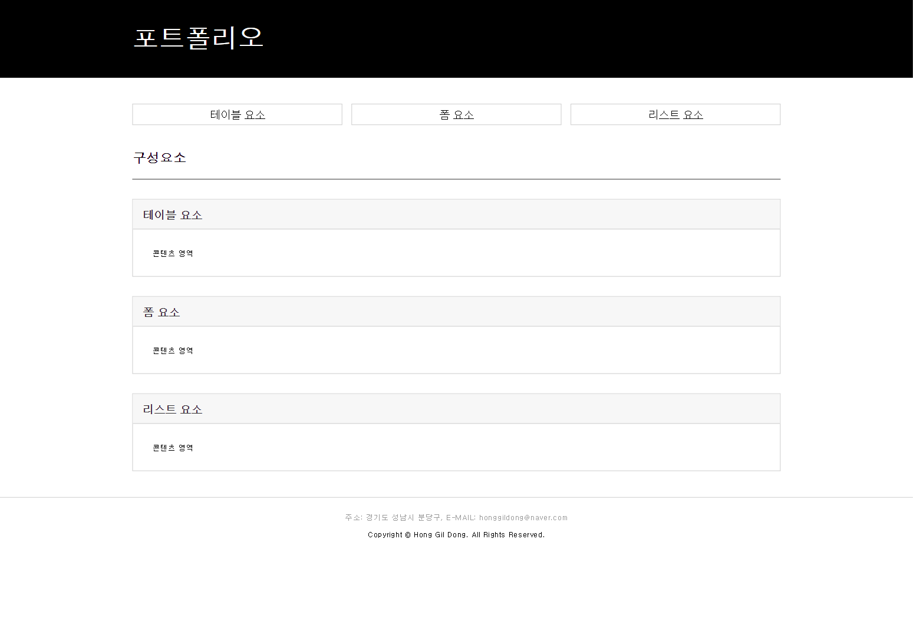
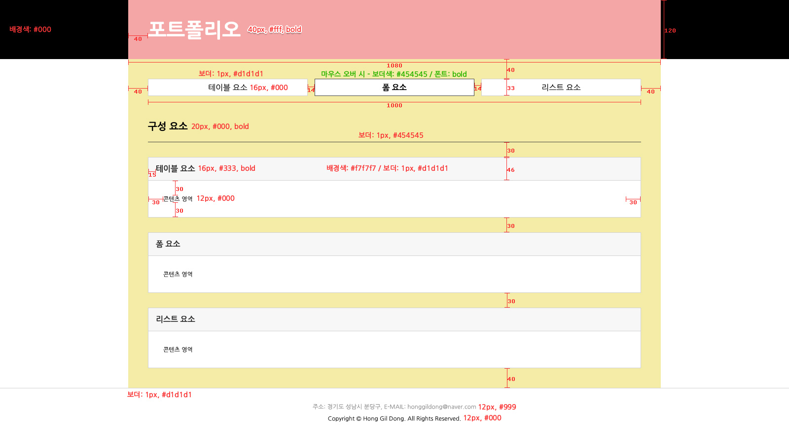

## 구현 결과



---

<br/>

## 평가기준표

### 화면 레이아웃

- 디자인 가이드는 최대한 맞춘다.

- 헤더의 배경과 푸터의 보더는 브라우저 너비의 100%를 차지한다.

- 헤딩 태그는 순차적으로 사용한다.

- 기본 폰트는 '나눔 고딕', NanumGothic, '돋움', Dotum, sans-serif를 선언한다.

- 메뉴('테이블 요소', '폼 요소', '리스트 요소') 클릭 시 현재 페이지 내에서 해당 콘텐츠 영역으로 이동한다.

- 메뉴 영역은 마우스 오버 시 보더 컬러 값을 변경하고 폰트에 볼드 효과를 적용한다.

- 코드 유효성 검사를 통과한다.

### HTML

- HTML5로 작성하며 그에 맞는 DTD를 선언한다.

- 언어 속성은 한국어로 선언한다.

- HTML의 인코딩은 유니코드 UTF-8로 지정한다.

- 의미에 맞는 태그를 최대한 사용한다. (시맨틱 마크업)

- 불필요한 주석문은 작성하지 않는다.

- 불필요한 코드는 작성하지 않는다.

### CSS

- 스타일 시트의 인코딩은 유니코드 UTF-8로 지정한다.

- 외부 스타일 시트로 작업한다.

- id 선택자에 스타일 선언을 하지 않는다. (class 선택자 권장)

- 불필요한 코드는 작성하지 않는다.

---

<br/>

## 디자인 가이드



---

<br/>

## 기술 요구 사항

### HTML

1. 의미에 맞는 태그를 최대한 사용합니다. (시맨틱 마크업)

2. 문서의 내용은 논리적인 흐름에 맞게 작성합니다.

3. 코드 유효성 검사를 통과합니다. (https://validator.w3.org/)

### CSS

1. 외부 스타일 시트로 작업합니다.

2. 클래스 이름(네이밍)은 규칙성 있게 작성합니다.

3. 가이드에 있는 수치는 정확하게 작성합니다.

4. 코드 유효성 검사를 통과합니다. (https://jigsaw.w3.org/css-validator/)

### 크로스 브라우징

- 크롬, 파이어폭스, 엣지, 웨일 최신 버전에서 확인합니다.

- Chrome / Firefox / Edge : ver. 109

- Whaile : 3.18

---

<br/>

## 프로젝트 폴더 구조

```shell

/portfolio
    ㄴ /css
        ㄴ portfolio.css
    ㄴ portfolio.html

```
