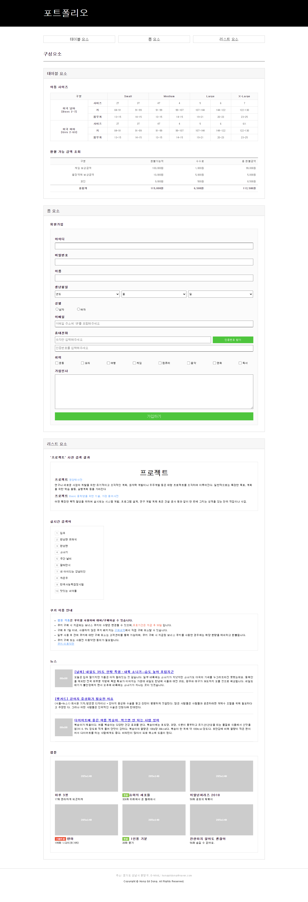
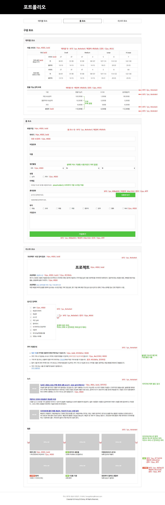

## 구현 결과



---

<br/>

## 상세 구현 사항

### 화면 레이아웃 - 구성 요소 (테이블 요소)

- 테이블의 보더 표현 방식은 border-collapse 속성을 사용한다.

- `<caption>`을 사용하여 표의 제목을 지정한다.

- 각 셀의 너비는 `<colgroup>` 요소 사용을 권장한다.

- `<thead>`, `<tbody>`, `<tfoot>`을 사용하고 `<th>`, `<td>`를 구분해서 사용한다.

- '환불 가능 금액 조회' 테이블의 가격은 우측 정렬한다.

- 코드 유효성 검사를 통과한다.

### 화면 레이아웃 - 구성 요소 (폼 요소)

- 의미에 맞는 폼 요소와 인풋 타입 값을 정의한다.

- `<label>`요소와 폼 요소를 연결한다.

- 셀렉트 박스의 라운드 스타일은 크롬 브라우저의 기본 스타일이므로 별도 스타일은 선언하지 않는다.

- '인증번호 받기', '가입하기'는 `<button>` 태그를 사용하고, 마우스 오버 시 커서 모양은 손 모양으로 변경한다.

- 폼 요소에 있는 안내 문구는 placeholder 속성을 사용한다.

- 코드 유효성 검사를 통과한다.

### 화면 레이아웃 - 구성 요소 (리스트 요소)

- 의미에 맞는 리스트 태그를 사용한다.

- '뉴스' 리스트의 이미지 영역과 제목 영역은 각각 링크 처리한다.

- '웹툰' 리스트의 이미지 영역과 텍스트 영역은 묶어서 하나의 링크로 처리한다.

- '실시간 검색어', '웹툰' 리스트의 텍스트 영역은 마우스 오버 시 언더라인을 적용한다.

- 코드 유효성 검사를 통과한다.

### HTML

- HTML5로 작성하며 그에 맞는 DTD를 선언한다.

- 언어 속성은 한국어로 선언한다.

- HTML의 인코딩은 유니코드 UTF-8로 지정한다.

- 의미에 맞는 태그를 최대한 사용한다. (시맨틱 마크업)

- 불필요한 주석문은 작성하지 않는다.

- 불필요한 코드는 작성하지 않는다.

### CSS

- 스타일 시트의 인코딩은 유니코드 UTF-8로 지정한다.

- 외부 스타일 시트로 작업한다.

- id 선택자에 스타일 선언을 하지 않는다. (class 선택자 권장)

- 불필요한 코드는 작성하지 않는다.

---

<br/>

## 디자인 가이드



---

<br/>

## 기술 요구 사항

### HTML

1. 의미에 맞는 태그를 최대한 사용합니다. (시맨틱 마크업)

2. 문서의 내용은 논리적인 흐름에 맞게 작성합니다.

3. 코드 유효성 검사를 통과합니다. (https://validator.w3.org/)

### CSS

1. 외부 스타일 시트로 작업합니다.

2. 클래스 이름(네이밍)은 규칙성 있게 작성합니다.

3. 가이드에 있는 수치는 정확하게 작성합니다.

4. 코드 유효성 검사를 통과합니다. (https://jigsaw.w3.org/css-validator/)

### 크로스 브라우징

- IE10 이상

- 크롬, 파이어폭스, 웨일은 최신 버전에서 확인합니다.

---

<br/>

## 프로젝트 폴더 구조

```shell

/portfolio
    ㄴ /css
        ㄴ portfolio.css
    ㄴ /image
        ㄴ thumbnail1.jpg
        ㄴ thumbnail2.jpg
    ㄴ portfolio.html
```
