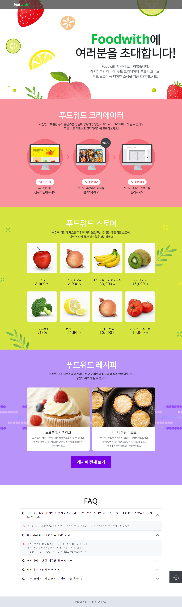
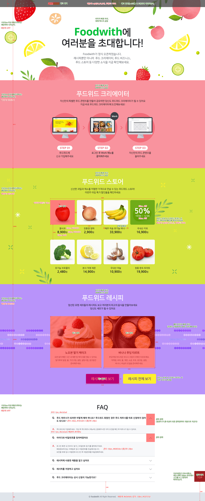

## 구현 결과



---

<br/>

## 평가기준표

### 화면 레이아웃

- 공통

  - 디자인 가이드는 최대한 맞춘다.
    - 헤딩 태그는 순차적으로 사용한다.
    - 기본 폰트는 '나눔 고딕', NanumGothic, '돋움', Dotum, sans-serif를 선언한다.
    - 각 콘텐츠의 배경색은 브라우저 너비의 100%를 차지한다.
    - 코드 유효성 검사를 통과한다.

- 헤더

  - 배경색은 반투명으로 적용한다.
  - 스크롤 시 브라우저 상단에 고정하고, z-index를 사용하여 다른 콘텐츠보다 위에 있어야 한다.
  - 로고는 IR 기법을 사용하여 이미지(logo.png)로 배경 처리하고, 대체 텍스트를 제공한다.

- 메인 배너

  - IR 기법을 사용하여 이미지(section_invite.jpg)로 배경 처리하고, 대체 텍스트를 제공한다.

- 크리에이터

  - IR 기법을 사용하여 이미지(section_creator.jpg)로 배경 처리하고, 대체 텍스트를 제공한다.

- 스토어

  - IR 기법을 사용하여 이미지(section_store.jpg)로 배경 처리하고, 대체 텍스트를 제공한다.
  - 상품 이미지는 각각 링크 처리한다.
  - 상품 이미지에 마우스 오버/키보드 포커스 시 할인정보 영역을 활성화한다.

- 레시피

  - 배경 패턴 이미지(pattern_recipe.png)는 가로로 반복 적용하고, 세로 중앙에 위치한다.
  - IR 기법을 사용하여 이미지(section_recipe.jpg)로 배경 처리하고, 대체 텍스트를 제공한다.
  - 레시피는 각각 링크 처리한다.
  - '레시피 전체보기'는 IR 기법을 사용하여 이미지(go_recipe.gif)로 배경 처리하고, 대체 텍스트를 제공한다.
  - '레시피 전체보기'는 마우스 오버/키보드 포커스 시 활성화 이미지(go_recipe_over.gif)로 변경한다.

- FAQ

  - FAQ(title_faq.gif), Q(icon_question.gif), A(icon_answer.gif)는 IR 기법을 사용하여 이미지로 배경 처리하고, 대체 텍스트를 제공한다.
  - answer 영역은 기본적으로 숨긴다.
  - answer 영역의 활성화는 인라인 스타일(style="display: block;")로 선언하지 않고 추가 클래스로 적용한다.
  - 화살표는 `<button>` 태그를 사용한다.
  - 화살표는 IR 기법을 사용하여 이미지(icon_arrow_down.gif)로 배경 처리하고, 대체 텍스트('펼침')를 제공한다.
  - answer 영역 활성화 시 화살표 이미지는 icon_arrow_up.gif로 변경하고, 대체 텍스트('닫힘')를 변경한다.

- TOP

  - TOP은 IR 기법을 사용하여 이미지(go_top.gif)로 배경 처리하고, 대체 텍스트를 제공한다.
  - 스크롤 시 항상 브라우저 우측 하단에 고정한다.
  - 클릭 시 현재 페이지 내에서 최상단으로 이동한다.

### HTML

- HTML5로 작성하며 그에 맞는 DTD를 선언한다.

- 언어 속성은 한국어로 선언한다.

- HTML의 인코딩은 유니코드 UTF-8로 지정한다.

- 의미에 맞는 태그를 최대한 사용한다. (시맨틱 마크업)

- 불필요한 주석문은 작성하지 않는다.

- 불필요한 코드는 작성하지 않는다.

### CSS

- 스타일 시트의 인코딩은 유니코드 UTF-8로 지정한다.

- 외부 스타일 시트로 작업한다.

- id 선택자에 스타일 선언을 하지 않는다. (class 선택자 권장)

- 불필요한 코드는 작성하지 않는다.

<br/>

### 기술 요구 사항

### HTML

1. 의미에 맞는 태그를 최대한 사용합니다. (시맨틱 마크업)

2. 문서의 내용은 논리적인 흐름에 맞게 작성합니다.

3. 코드 유효성 검사를 통과합니다. (https://validator.w3.org/)

### CSS

1. 외부 스타일 시트로 작업합니다.

2. 클래스 이름(네이밍)은 규칙성 있게 작성합니다.

3. 가이드에 있는 수치는 정확하게 작성합니다.

4. 코드 유효성 검사를 통과합니다. (https://jigsaw.w3.org/css-validator/)

### 크로스 브라우징

- 크롬, 파이어폭스, 엣지, 웨일 최신 버전에서 확인합니다.

- Chrome / Firefox / Edge : ver. 109

- Whaile : 3.18

---

<br/>

## 디자인 가이드



---

<br/>

## 프로젝트 폴더 구조

```shell

/promotion
    ㄴ /css
        ㄴ promotion.css
    ㄴ /image
    ㄴ promotion.html
```
