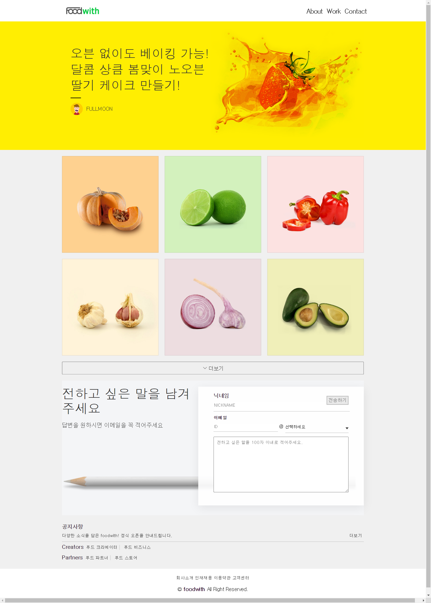
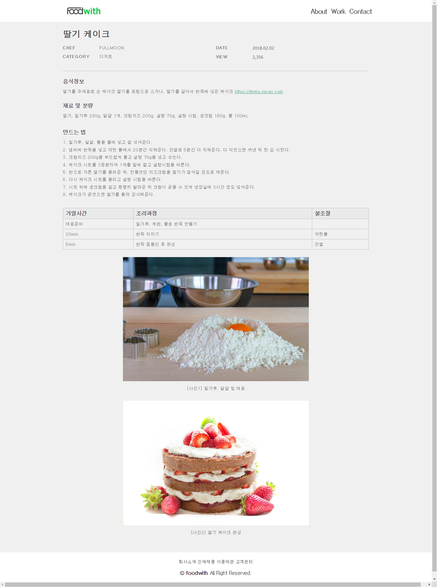
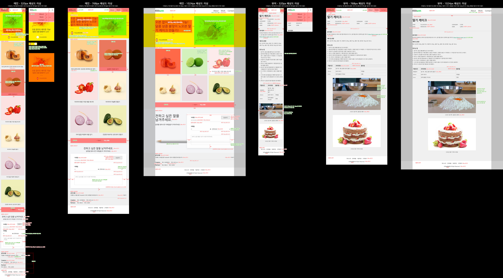

## 구현 결과



<br/>



---

<br/>

## 평가기준표

### 화면 레이아웃 - 공통

- 모든 해상도

  - 디자인 가이드는 최대한 맞춘다.
  - 헤딩 태그는 순차적으로 사용한다.
  - 기본 폰트는 '나눔 고딕', NanumGothic, '돋움', Dotum, sans-serif를 선언한다.
  - 해상도 1024px 미만까지 모든 콘텐츠는 가변 대응되어야 하고, 해상도 1024px 이상부터는 고정 사이즈로 화면 가로 중앙에 위치한다. (프로젝트 가이드 > responsive 참고)
  - 코드 유효성 검사를 통과한다.

### 화면 레이아웃 - 헤더

- 해상도 320px 이상

  - 로고는 'IR(Image Replacement) 기법'을 사용하여 모바일 이미지(logo_m.png)로 배경 처리하고, 대체 텍스트를 제공한다.
  - 메뉴(About, Work, Contact)는 기본적으로 숨긴다.
  - 메뉴(About, Work, Contact)의 활성화는 인라인 스타일(style="display: block;")로 선언하지 않고 추가 클래스로 적용한다.

- 해상도 768px 이상

  - 우측 햄버거 버튼은 숨김 처리한다.
  - 메뉴(About, Work, Contact)는 노출시킨다.

- 해상도 1024px 이상
  - 로고는 PC 이미지(logo_pc.png)로 변경한다.
  - 메뉴(About, Work, Contact)에 마우스 오버 시 볼드 효과를 적용한다.

### 화면 레이아웃 - main > 배너 영역

- 해상도 320px 이상

  - 작성자 섬네일 이미지가 없을 경우를 대비하여 배경을 기본 이미지(thumbnail_profile_none.jpg)로 적용한다.
  - 작성자 섬네일 라운드 처리는 CSS로 적용한다.
  - 딸기 이미지는 화면 가로 중앙에 위치한다.
  - 타이틀 영역은 2줄 이상일 경우 말줄임한다.

- 해상도 768px 이상

  - 딸기 이미지는 화면 가로 우측 끝, 세로 중앙에 위치한다.
  - 타이틀 영역은 3줄 이상일 경우 말줄임한다.

### 화면 레이아웃 - main > 리스트 영역

- 해상도 320px 이상

  - 이미지는 ``태그를 사용한다.
  - 이미지 위 가장자리에 반투명 보더를 적용한다.
  - 이미지 영역과 텍스트 영역은 묶어서 하나의 링크로 처리한다.
  - 한 행에 하나의 리스트가 있다.

- 해상도 768px 이상

  - 한 행에 두 개의 리스트가 있다.

- 해상도 1024px 이상

  - 한 행에 세개의 리스트가 있다.
  - 텍스트 영역은 숨김 처리한다.
  - 이미지에 마우스 오버/키보드 포커스 시 딤드 레이어와 텍스트 영역을 활성화한다.

### 화면 레이아웃 - main > 폼 영역

- 해상도 320px 이상

  - 의미에 맞는 폼 요소를 정의한다.
  - `<label>`요소와 폼 요소를 연결한다.
  - '전송하기' 버튼은 `<button>` 태그를 사용하고, 폼 내용을 다 작성한 후 전송할 수 있도록 소스 마지막에 위치한다.
  - 폼 요소에 있는 안내 문구는 placeholder 속성을 사용한다.
  - 셀렉트 박스의 화살표는 이미지(icon_arrow_email.png)로 배경 처리한다.

- 해상도 1024px 이상

  - '전송하기' 버튼은 마우스 오버 시 커서 모양을 손 모양으로 변경한다.
  - 연필 이미지는 배경으로 처리하고, 폼 영역의 배경은 반투명으로 적용한다.

### 화면 레이아웃 - main > 공지사항 영역

- 해상도 320px 이상

  - 공지사항 문구와 '더보기'는 각각 링크 처리한다.
  - 공지사항 문구는 '더보기'와 영역이 겹치지 않도록 한 줄 말줄임 처리하고, '더보기'는 화면 가로 우측 끝에 위치한다.

- 해상도 768px 이상

  - 'Creators', 'Partners'의 하위 요소('푸드 크리에이터', '푸드 비즈니스', '푸드 파트너 안내', '푸드 스토어')는 우측에 위치한다.

### 화면 레이아웃 - view > 제목 영역

- 해상도 320px 이상

  - 한 행에 하나의 분류가 있다.

- 해상도 768px 이상

  - 한 행에 두 개의 분류가 있다.

### 화면 레이아웃 - view > 본문 영역

- 해상도 320px 이상

  - '음식 정보'에서 링크는 새 창으로 처리한다.
  - '만드는 법'은 2줄 이상부터 들여쓰기 한다.
  - `<caption>`을 사용하여 표의 제목을 지정한다.
  - 이미지와 설명 문구는 `<figure>`태그를 사용한다.
  - 이미지 너비는 디바이스에 꽉 차게 처리한다.

- 해상도 768px 이상

  - 이미지의 너비 값은 최대 600px 이상 커지지 않고 화면 가로 중앙에 위치한다.

### HTML

- HTML5로 작성하며 그에 맞는 DTD를 선언한다.

- 언어 속성은 한국어로 선언한다.

- HTML의 인코딩은 유니코드 UTF-8로 지정한다.

- 의미에 맞는 태그를 최대한 사용한다. (시맨틱 마크업)

- 불필요한 주석문은 작성하지 않는다.

- 불필요한 코드는 작성하지 않는다.

### CSS

- 스타일 시트의 인코딩은 유니코드 UTF-8로 지정한다.

- 외부 스타일 시트로 작업한다.

- id 선택자에 스타일 선언을 하지 않는다. (class 선택자 권장)

- 불필요한 코드는 작성하지 않는다.

<br/>

### 기술 요구 사항

### HTML

1. 의미에 맞는 태그를 최대한 사용합니다. (시맨틱 마크업)

2. 문서의 내용은 논리적인 흐름에 맞게 작성합니다.

3. 코드 유효성 검사를 통과합니다. (https://validator.w3.org/)

### CSS

1. 외부 스타일 시트로 작업합니다.

2. 클래스 이름(네이밍)은 규칙성 있게 작성합니다.

3. 가이드에 있는 수치는 정확하게 작성합니다.

4. 코드 유효성 검사를 통과합니다. (https://jigsaw.w3.org/css-validator/)

### 크로스 브라우징

- 크롬, 파이어폭스, 웨일은 최신 버전에서 확인합니다.

  - Chrome / Firefox : ver. 109

  - Whaile : 3.18

- IE10 이상

---

<br/>

## 디자인 가이드



---

<br/>

## 프로젝트 폴더 구조

```shell

/promotion
    ㄴ /css
        ㄴ promotion.css
    ㄴ /image
    ㄴ promotion.html
```

```shell


/foodwith
    ㄴ /css
        ㄴ foodwith.css
    ㄴ /image
    ㄴ main.html
    ㄴ view.html


```
